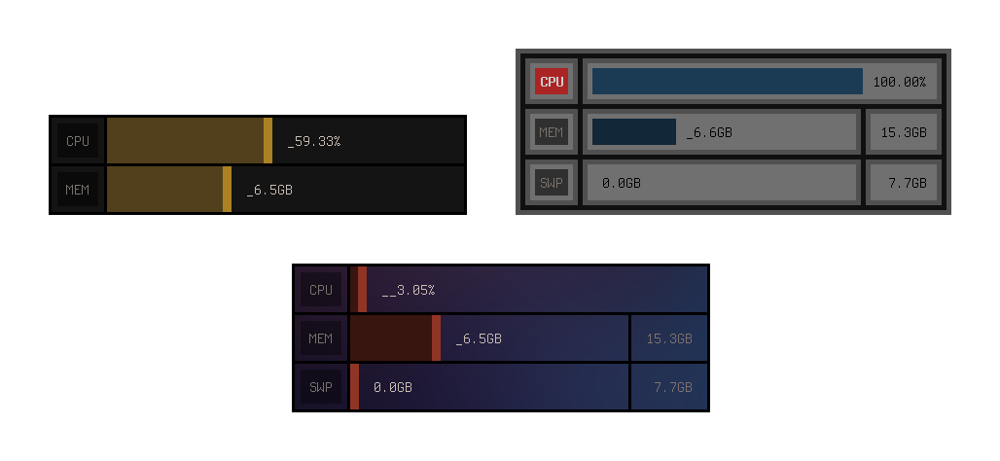

SysGauges
=========

<p align="center"></p>

SysGauges is a tiny GUI system monitor that keeps track of the CPU load (1min average), RAM and SWAP usage. It's made with the Cassette framework. This program is free and open-source software licensed under the [AGPL-3.0](https://www.gnu.org/licenses/agpl-3.0.html). It's made to run on modern POSIX systems with an X11 display server.

Dependencies
------------

- Tools :

	- C11 compiler with a stdlib
	- Make

- Library

	- [Cassette](/../../../../fraawlen/cassette) 

Installation
------------

First, edit the makefile if you want to change the installation destination. It represented by the variables `DIR_INSTALL`. By default, they are set to `/usr/bin/`. Then, build and install SysGauges with the following commands :

```
make
make install
```

Usage
-----

```
sysgauges [option] <value>
```

By default, the window is created at the top-left of your screen with coordinates 0,0. The maximum values are not displayed, the update interval is set to 1 second, and the alert threshold (the value limit after which an indicator lights up) is set to 0.95. If your system does not use swap, the swap memory gauge will be hidden. These values can be modified using the following options:

```
-a <0.0..1.0> : alert threshold
-h            : print help
-i <uint>     : update interval in seconds
-m            : show max MEM and SWP values
-v            : print extra information (window width and height)
-w <uint16_t> : custom width
-x <int16_t>  : custom x coordinate
-y <int16_t>  : custom y coordinate
```
Appearance can be modified through [Cassete's theming options](https://github.com/fraawlen/cassette/blob/trunk/dg.conf). The Cells (widgets) used in SysGauges are `gauge`, `label` and `indicator`.

Credits
-------

- [Terminus](https://terminus-font.sourceforge.net/), font used in banner picture

Mirrors
-------

- https://github.com/fraawlen/sysgauges
- https://codeberg.org/fraawlen/sysgauges
